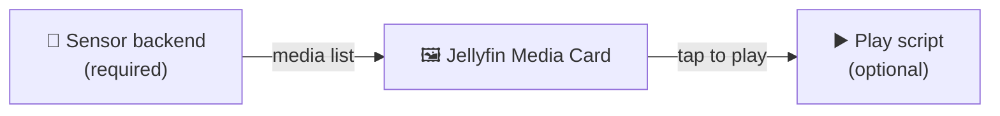

<div align="center">

# 📺 Jellyfin Media Card with Sonarr calendar support

**A Home Assistant Lovelace card that shows a rotating spotlight of your Jellyfin media — with tap-to-play or Sonarr calendar**

Poster or episode artwork · multiple transition effects · per-library art overrides ·
synced rotation across cards · responsive mobile layouts · detailed **and** image-only modes.

[](https://my.home-assistant.io/redirect/hacs_repository/?owner=a4happy20&repository=jellyfin-media-card&category=plugin)


</div>

---

## Contents

- [What is it?](#what-is-it)
- [How the pieces fit](#how-the-pieces-fit)
- [Screenshots & demo](#screenshots--demo)
- [Features](#features)
- [Prerequisites](#prerequisites)
- [Installation](#installation)
- [Usage](#usage)
- [Configuration options](#configuration-options)
- [Styling with Card Mod](#styling-with-card-mod)

<br>

## What is it?

A custom Lovelace card that turns a Home Assistant sensor full of Jellyfin media or sonarr calendar
into a good-looking, rotating spotlight on your dashboard. (Optional) Tap an item and it plays.

After adding a sensor it gives you:

- A **rotating carousel** of recently added items, one at a time.
- **Poster or episode artwork**, with per-library overrides.
- Three page transitions — `slide`, `coverflow`, and `fade`.
- **Three display modes**: detailed, image-only, or upcoming(sonarr calendar).
- **Responsive layouts** that adapt to card size on mobile, plus `full` and `half` layouts.
- **Synced rotation** — multiple cards can be grouped to rotate together.

<br>

After adding a script it gives you:

- **Tap-to-play** — tapping an episode triggers a script with data "episode_id" of the tapped episode.

<br>

## How the pieces fit

The card doesn't fetch from Jellyfin itself — it renders a **sensor** you provide, and
hands taps off to a **script**. Three moving parts:

<details>
  <summary><b>Flow</b></summary>


</details>

| Piece | Repository | Required? | What it does |
|-------|------------|-----------|--------------|
| **Sensor backend** | [jellyfin-media-card-sensors](https://github.com/a4happy20/jellyfin-media-card-sensors) | ✅ Yes | Feeds the card its list of media items |
| **Sensor backend** | [sonarr-calendar-card-sensors](https://github.com/a4happy20/sonarr-calendar-card-sensors) | ✅ Yes | Feeds the card its list of media items |
| **Play script** | [jellyfin-media-card-play](https://github.com/a4happy20/jellyfin-media-card-play) | Optional | Handles what happens when you tap an item |

> [!TIP]
> New here? You need at least one compatible sensor for the card to work.
> Setup is simple. Just add the sensors, enter your api & url.
> Use the Jellyfin **[sensor backend](https://github.com/a4happy20/jellyfin-media-card-sensors)**
> And/Or the Sonarr **[sensor backend](https://github.com/a4happy20/sonarr-calendar-card-sensors)**

<br>

## Screenshots & demo

<details>
  <summary><b>Config</b></summary>
  
</details>

<details>
  <summary><b>Layout</b></summary>
  
</details>

<details>
  <summary><b>Demo (video)</b></summary>
  <video src="https://github.com/user-attachments/assets/7b57b3e8-54c0-4ff0-86db-0995b9cd8178" controls width="200" alt="Demo"></video>
</details>

<details>
  <summary><b>Poster mode</b></summary>
  
</details>

<details>
  <summary><b>Mobile (stacks at taller layouts)</b></summary>
  
</details>

<br>

## Features

- Rotating spotlight of recently added items from a template sensor
- Tap an item to trigger a script
- Poster or episode artwork, with per-library overrides
- `slide`, `coverflow`, and `fade` page transitions
- `full` and `half` layouts for the Sections dashboard grid
- `upcoming` layout designed for the sonarr calendar sensor
- `progress bar` for continue watching sensor attribute "resume_pct"
- `options button` button that shows more info of a configurable entity
- Swipe on mobile, horizontal scroll on desktop
- Sync rotation across multiple cards via a shared `sync_group`
- Highly customizable

<br>

## Prerequisites

This card renders a **template sensor that you provide**. Its configured attribute
(default `episodes`) must be a list of items shaped like this:

```jsonc
{ id, series, season, episode, title, overview, library, episode_art, series_art, added }
```

You don't have to build that by hand — the Jellyfin **[sensor backend](https://github.com/a4happy20/jellyfin-media-card-sensors)**
or the Sonarr **[sensor backend](https://github.com/a4happy20/sonarr-calendar-card-sensors)** produces it for you,
and its README walks you through pointing it at your own instance.
The optional **[play script](https://github.com/a4happy20/jellyfin-media-card-play)**
handles tap-to-play.

<br>

## Installation

The easiest path is **HACS**. One-click add:

[](https://my.home-assistant.io/redirect/hacs_repository/?owner=a4happy20&repository=jellyfin-media-card&category=plugin)

Or add it by hand in HACS:

1. In HACS, open the three-dot menu → **Custom repositories**.
2. Paste this repository's URL and choose category **Dashboard** (plugin).
3. Search for **Jellyfin Media Card** and install it.
4. HACS registers the resource automatically (on storage-mode dashboards).

<details>
  <summary><b>Manual install</b> (without HACS)</summary>

<br>

1. Download `jellyfin-media-card.js` from the latest [release](../../releases/latest).
2. Copy it to `config/www/jellyfin-media-card/jellyfin-media-card.js`.
3. Register the resource (**Settings → Dashboards → three-dot menu → Resources**):
   - **URL:** `/local/jellyfin-media-card/jellyfin-media-card.js`
   - **Type:** JavaScript Module

For HACS installs, the resource URL is
`/hacsfiles/jellyfin-media-card/jellyfin-media-card.js` with type `module`.
</details>

<details>
  <summary><b>YAML-mode dashboards</b></summary>

<br>

If your dashboard uses `mode: yaml`, HACS can't register the resource automatically —
add it yourself:

```yaml
resources:
  - url: /hacsfiles/jellyfin-media-card/jellyfin-media-card.js
    type: module
```
</details>

<br>

## Usage

The simplest possible card — just a type and a sensor:

```yaml
type: custom:jellyfin-media-card
entity: sensor.jellyfin_recent_card_data
```

A fuller example showing common options:

```yaml
type: custom:jellyfin-media-card
entity: sensor.jellyfin_recent_card_data
title: Recently Added
play_script: script.jellyfin_play_episode_custom_card
id_field: episode_id
layout: full
rotate_seconds: 8
art_mode: poster
art_overrides:
  library: episode      # one entry per library key from your sensor
  library2: episode
transition: fade
sort_mode: interleaved
font_scale: 0.9
grid_options:
  columns: full
  rows: 6
```

> [!NOTE]
> The keys under `art_overrides` (`library`, `library2`, …) are the library names you
> defined in the Jellyfin **sensor backend**. Match them to whatever you named your libraries there.

<br>

## Configuration options

<details>
  <summary><b>All options</b></summary>

<br>

**Core**

| Option | Type | Default | Description |
|--------|------|---------|-------------|
| `type` | string | — | `custom:jellyfin-media-card` (required) |
| `entity` | string | — | Template sensor holding the media list (required). See the [sensor backend](https://github.com/a4happy20/jellyfin-media-card-sensors). |
| `attribute` | string | `episodes` | Attribute on the sensor containing the list |
| `play_script` | string | `script.jellyfin_play_episode` | Script called on tap |
| `id_field` | string | `episode_id` | Field passed to the play script as the item ID. See the [play script](https://github.com/a4happy20/jellyfin-media-card-play). |
| `title` | string | `""` | Card header title |
| `options_entity` | string | `"input_select.jellyfin_media_player"` | button that shows an entity's more info |
| `api_key` | string | — | Optional — usually **not** needed. Appended to art URLs that require auth. |

**Rotation & sorting**

| Option | Type | Default | Description |
|--------|------|---------|-------------|
| `rotate_seconds` | number | `8` | Seconds per item; `0` disables auto-rotation |
| `sort_mode` | string | `interleaved` | `interleaved` (newest across libraries) or `grouped` (by library) |
| `transition` | string | `slide` | Page effect: `slide`, `coverflow`, or `fade` |
| `sync_group` | string | `""` | Cards sharing a value rotate together off one clock |

**Artwork & background**

| Option | Type | Default | Description |
|--------|------|---------|-------------|
| `art_mode` | string | `poster` | Default artwork: `poster` or `episode` |
| `art_overrides` | object | `{}` | Per-library art mode, e.g. `{ youtube: episode }` |
| `poster_ratio` | string | `183/274` | Frame ratio when showing poster art |
| `episode_ratio` | string | `16/9` | Frame ratio when showing episode art |
| `background_type` | string | `"art"` | Background style: `art`, `custom`, or `theme` |
| `background:` | string | `url("{episode_art}") center/contain no-repeat` | Only used when `background_type: custom` |

**Layout & text**

| Option | Type | Default | Description |
|--------|------|---------|-------------|
| `layout` | string | `full` | `full` (full width) or `half` (poster tile, 6/12 grid columns) |
| `layout` | string | `full` | `upcoming` (alternate layout for sonarr calendar) |
| `show_progress` | toggle | `true/false` | `continue_watching` (display progress bar) |
| `font_scale` | number | `1.0` | Scales card text (0.5–2.0) |

**Colors**

Each of these accepts: `primary`, `accent`, `default`, `red`, a hex value like
`#252525`, or an `rgb()` / `rgba()` value such as `rgb(25,25,25,0.8)`.

| Option | Type | Default | Applies to |
|--------|------|---------|------------|
| `accent_color` | string | `""` | Accent elements |
| `title_color` | string | `""` | Item title |
| `header_color` | string | `""` | Card header |
| `episode_color` | string | `""` | Episode label |
| `counter_color` | string | `""` | Item counter/Options button |
| `description_color` | string | `""` | Description text |
| `progress_color` | string | `""` | Progress Bar |

</details>

<br>

## Continue Watching Visibility

I like to have a continue watching card set to only appear when at least one episode exists:

```yaml
visibility:
  - condition: numeric_state
    above: 0
    entity: sensor.jellyfin_continue_watching_card_data
```

<br>

## Styling with Card Mod

The card exposes a few size-based modes you can target when styling:

```
.content.small
.content.tiny
.content.compact
.content.half
.content.upcoming
```

<details>
  <summary><b>Example: minimal poster styling</b></summary>

<br>

```yaml
card_mod:
  style: |
    .dots {
      display: none;
    }
    .poster-wrap {
      transform: scale(1.2);
      background: none;
      box-shadow: none;
      border: none;
      border-radius: 15px;
    }
    .poster {
      transform: scale(1.0);
      border-radius: 15px;
    }
    ha-card {
      background: none;
    }
    .content.half .dots {
      display: none;
    }
    .content.half .poster-wrap {
      transform: scale(1.2);
      background: none;
      box-shadow: none;
      border: none;
      border-radius: 15px;
    }
    .content.half .poster {
      transform: scale(1.0);
      border-radius: 15px;
    }
    .content.half ha-card {
      background: none;
    }
```

<details>
  <summary>Result (bottom left)</summary>
  
</details>

</details>

<br>

## License

Licensed under the [GNU General Public License v3.0](LICENSE). You're free to use,
modify, and distribute this software, including commercially, provided that derivative
works are also released under the GPLv3 and their source is made available.
